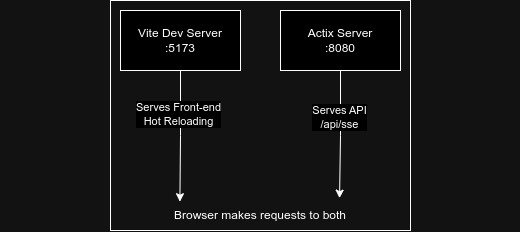
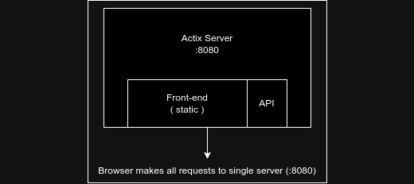

# WEB TAIL

<br>
&emsp; WebTail is just a tail to a file that yoyu can watch from the UI. There's 3 parts to the project. UI, Server & Client. Here client is the one who connects from servers/pods/instances to push data to the server. Both Server & Client are rust applications. Server has a simple actix server. Client is Svelte application.\

## Goal
- Main goal of this project is to learn svelte, and work on my rust. 
- Also fed up of wasting time trying to figure out the mess shown in the EFK logs.
- Just want to get a familiar [`tail`](https://www.ibm.com/docs/en/aix/7.3?topic=t-tail-command) for the application I want to check logs of.
## Architecture


## Server
Server will serve the UI and will act as a router for the data coming in from clients, server will expose web sockets for clients to connect and send the live feed, and expose SSE end points for UI users to connect and get the application log. Users can select an application from the drop down to look at the logs of the application (application - server/pod/instance).

### Server Architecture
#### In Development


#### In Production


## Development
1. clone the [`repository`](https://github.com/uratne/webtail) and setup submodule.
```bash
git clone https://github.com/uratne/webtail
cd f___-efs
git submodule init
git submodule update
```
2. UI is in the [`fronentd`](https://github.com/uratne/webtail-front) directory.

3. As the [above](#in-development) document shows we can up a vite server using
```bash
npm run dev
```
- this let's us have hot reloading features and other features from vite.
4. To up the client
```bash
cargo run --bin client
```
5. To up the server
```bash
cargo run --bin server
```
6. Running `main.rs` will give you these commands.
```bash
cargo run
```

## Deployment
Currently Server is also a binary, later server and ui will be packaged togeather in a container for simpler deployment
1. Server
    1. add `.env` to the directory you are running server from
    2. `PATH_TO_FRONTEND` in `.env` should point to the build direrctory of the frontend
    3. run server
2. Client
    1. configure `webtail_config,json`
        1. `app_name`, can be a SinglePod application or MultiplePod (instance) application. If it's MultiplePod set the pod_name also, this application name and pod name will be shown in the front end to select. 
        2. `log_file_dir`, is the relative/absolute path to the log file you want to tail
        3. `log_file_name_regex`, is the name of the file, regex is accepted here. If you are using a regex first found file will be tailed. Regex is allowed as for some reason log files are named with data time or something.
        4. `server_host`, is the host to connect to the server
        5. `server_port`, is the port to connect to the server, set 0 to the port if a port is not required
        6. `server_path`, is the path to connect to the server
        - If `server_port` > 0
        > ws://`server_host`:`server_port`/`server_path`

        - If `server_port` == 0
        > ws://`server_host`/`server_path`

        7.`channel_buffer` is the buffer size of the `tokio::mpsc::channel`, leave it between 10-100

    1. add `webtail_config.json` to the directory you are running client from
    2. run client

## Roadmap
1. Login Page
2. Use binary for server client communication using [`borsh`](https://borsh.io).
3. Setup proper loging for server and client.
4. Manage `SIGTERM` for client and end web socket gracefully.